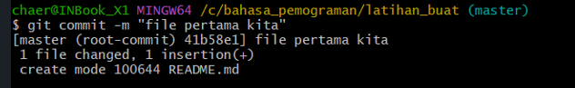

# tugas4

## tutorial git vcs

### kita membuat repositories

1.kita buat folder di pc kita 
2.kita ketik $mkdir latihan_buat untuk menambahkan folder 
3.kita pindah directory yg barusan kita buat dengan cara $cd latihan_buat  
  
4.kita akan inisilasisasi folder git dengan cara $git init  
 
5.kita menambahkan file baru pada repositori kita dengan cara $echo “# latihan buat repository” >> README.md. dan file README.md telah berhasil kita buat  
  
6.menambhkan file baru repository dengan cara $git add README.md  
  
7.selamat kita berhasil menambahkan file baru repository  
8.sekarang kita commit atau yang biasa kita kenal menyimpan perubahan ke database dengan cara $git commit -m "file pertama kita"  
  
9.setelah itu kita membuat respository ke server  
10.server repository yang kita buat menggunakan github.com  
11.anda harus membuat akun github dulu  
  
12.setelah anda berhasil membuat akun github anda pada halamam beranda klik start a project lalu buat new repository
 
13.membuat repository server
14.menambhakan remote repository dengan cara git remote add orign url
15.mengirim perubahan ke server dengan cara $git push -u orign master (biasa nya ada perintah untuk masukin akun github kita untuk konekin ke server)
16.buka akun github anda dan lihat pada repository nya maka perubahan akan terlihat di situh
